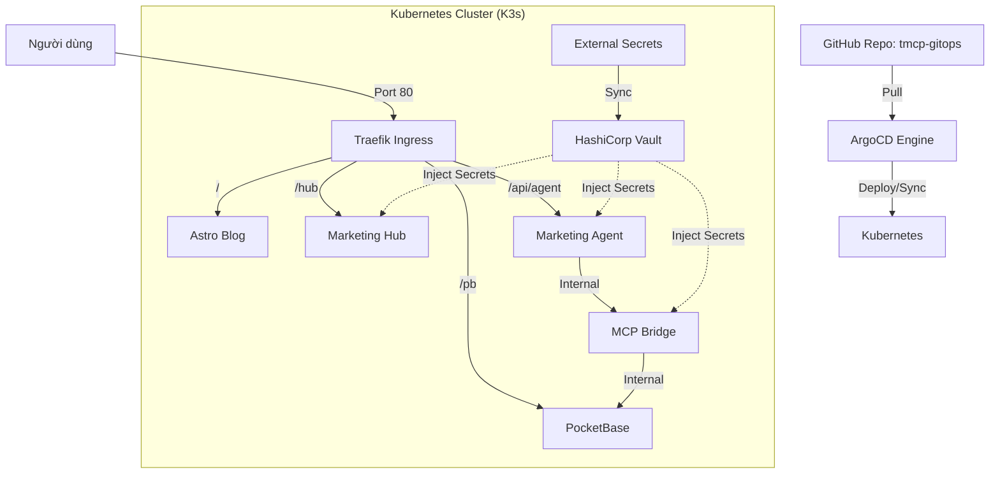

# 🏗️ TMCP (The Iron Commander) - System Architecture

> **TMCP** là hệ thống tự động hóa hạ tầng Kubernetes (K3s) từ con số 0 trên môi trường máy local (macOS), tích hợp sẵn GitOps (ArgoCD), Secret Management (HashiCorp Vault) và cơ chế tự phục hồi (Self-Healing).

---

## 1. Tổng Quan Các Lớp (Layered Design)

Hệ thống được thiết kế theo mô hình 4 lớp chồng lên nhau:

| Lớp | Công nghệ | Vai trò |
|-----|-----------|---------|
| **Lớp Ảo hóa** | Multipass (QEMU) | Tạo máy ảo Ubuntu 24.04 biệt lập trên Mac. |
| **Lớp Hạ tầng (IaC)** | Terraform | Tự động hóa việc tạo VM, cài K3s, cài ArgoCD & Vault. |
| **Lớp Secret** | Vault + ESO | Quản lý tập trung và đồng bộ hóa mật khẩu vào K8s. |
| **Lớp GitOps** | ArgoCD | Đồng bộ trạng thái từ GitHub Repo về Cluster. |

---

## 2. Sơ Đồ Luồng Dữ Liệu & Mạng

---

## 3. Các Cơ Chế Đặc Biệt (Key Features)

### 3.1. Cơ chế Tự Phục hồi & Ổn định Mạng (Network Stability)
Mọi ứng dụng trong hệ thống đều được trang bị:
- **Readiness Probe**: Đảm bảo Pod chỉ nhận traffic khi đã khởi động xong hoàn toàn (đã kết nối DB, đã load xong config).
- **Liveness Probe**: Tự động khởi động lại Pod nếu ứng dụng bị treo (deadlock) hoặc lỗi mạng nội bộ.

### 3.2. Quản lý Secret "Không dấu vết"
Hệ thống KHÔNG lưu mật khẩu trong code.
- **Vault**: Lưu trữ mật khẩu gốc (Source of Truth).
- **External Secrets Operator (ESO)**: Tự động "móc" mật khẩu từ Vault và tạo ra Kubernetes Secrets cho ứng dụng sử dụng.

### 3.3. Tối ưu hóa Tài nguyên
Hệ thống được cấu hình chạy trên máy ảo **6GB RAM** và **2 CPU**, đảm bảo đủ sức tải cho toàn bộ Stack (ELK, Vault, ArgoCD) mà không gây nghẽn mạng (handshake timeout).

---

## 4. Bảo Mật (Security Hardening)
- **OS Level**: Tường lửa UFW chỉ mở cổng 22, 80, 443, 6443. Fail2Ban chặn IP dò pass SSH.
- **SSH Level**: Chỉ cho phép đăng nhập bằng RSA Key (4096-bit), tắt hoàn toàn mật khẩu.
- **Vault Level**: Cơ chế niêm phong (Sealing) bảo vệ dữ liệu ngay cả khi VM bị tắt/khởi động lại.
